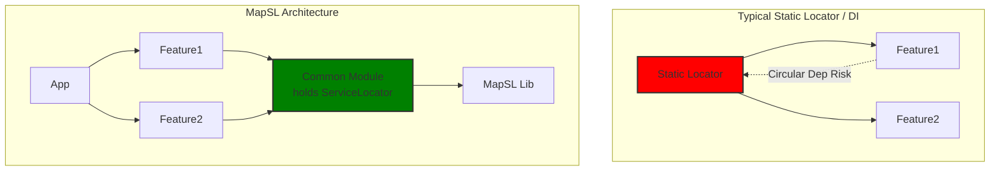

# MapSL

MapSL is a straightforward Service Locator library for Kotlin Multiplatform, designed to make dependency management simple and transparent.

The goal of MapSL is to provide an easy-to-learn alternative to more complex dependency injection frameworks. It achieves this by using a heterogeneous map at its core, without relying on annotation processing or code generation.

## Core Features

- **Multiplatform First**: Built for Kotlin Multiplatform, with primary support for Android and JVM, and compatibility with other platforms like iOS, macOS, and Native.

- **Type-Safe**: Uses Kotlin's type system to ensure that you always get the correct dependency type.

- **Testable**: Includes dedicated testing modules to easily swap out production dependencies with fakes or mocks in your tests.

- **Flexible Scoping**: Associate service locators with specific scopes to manage dependencies in different environments (e.g., production vs. testing, or multi-process applications).

- **No Code Generation**: Avoids the build-time overhead and complexity of annotation processors.

### **Architectural Benefits**

-   **Modular Build Friendly**: MapSL acts as a generic container, not a typed registry. This allows your central `ServiceLocator` to exist in a low-level module without depending on your Feature modules, preventing circular dependencies and maximizing compilation parallelism.
    
-   **True Lazy Loading**: Because the Locator holds no compile-time references to services, accessing one dependency doesn't force the classloader to load or verify unrelated parts of the app, improving startup performance.
    
-   **Colocated & Explicit Access**: Retrieval logic (e.g., `MyService.getInstance()`) is in the same file as the service definition. This makes obtaining an instance obvious to the caller and keeps refactoring contained within the service's file, rather than scattered across registry files.
    
-   **Test-Centric**: Includes zero-config mocking for unregistered keys and support for global fakes, drastically reducing test boilerplate.

## Declaring Dependencies

MapSL is available via Maven Central under the group id `dev.keyboardr.mapsl`.

Example:
`"dev.keyboardr.mapsl:simple:<version>"`

### Module Structure

MapSL consists of the following library modules:

- `core` - This contains the main `ServiceLocator` and various core key types, forming the foundation of the library.

- `lifecycle` - Includes `LifecycleKey` for integrating service lifetimes with AndroidX lifecycles. Built separately since it requires a dependency on `androidx.lifecycle`.

- `scoped` - Provides `ScopedServiceLocator` and supporting classes.

- `scoped-testing` - Provides a `ScopedServiceLocator` subclass suitable for use in tests, offering features like mock creation for unregistered keys.

- `simple` - Provides a more streamlined, but less powerful API for covering the common cases.

- `simple-scaffold` - Includes a basic `MainServiceLocator` when detailed scoping is not required.

- `simple-testing` - Similar to `scoped-testing`, but based on `simple`, offering testing utilities for the simplified API.

If you're just getting started with MapSL, it is recommended to start with the `simple` or `simple-scaffold` module for production and `simple-testing` in your tests.

## Multiplatform

MapSL is built to be multiplatform-first. Currently Android and JVM are the most well-tested, but other platforms are supported (e.g., iOS, macOS, Native). Most of MapSL is written against the common Kotlin standard library. Feel free to submit a pull request to add support for other platforms.

## Getting Started

For the most common use cases, we recommend starting with the `simple` module, which offers a streamlined API for managing dependencies.

For a step-by-step guide on setting up your project with MapSL, see the [**Getting Started Guide**](docs/getting-started.md).

## Documentation

- [**MapSL Flavors**](docs/flavors.md): Learn about the `Full`, `Simple`, and `Simple-Scaffold` flavors and which one is right for your project.

- [**Key Kinds and Concepts**](docs/keys.md): Understand the different kinds of Keys used to register and retrieve services.

- [**Using Scopes**](docs/scopes.md): Learn how to use scopes to manage dependencies in different environments.

- [**Testing with MapSL**](docs/testing.md): A detailed guide on how to test code that uses MapSL.

- [**Multiplatform Setup**](docs/multiplatform.md): Best practices for using MapSL in a Kotlin Multiplatform project.

- [**Using the Scaffold**](docs/scaffold.md): A guide to the `simple-scaffold` module for rapid setup.

- [**Migration Guide**](docs/migration.md): Instructions for migrating from the `simple` module to `core`.

- [**Service Locator vs. Dependency Injection**](docs/sl-vs-di.md): A brief comparison of the two patterns.

## Sample Projects

The following sample projects are provided to demonstrate various use cases:

- [**Basic**](samples/basic): A minimal project showing the fundamentals of `SimpleServiceLocator`.

- [**Scaffold**](samples/scaffold): Demonstrates the recommended architecture for a process-level service locator using the `simple-scaffold` module.

- [**Multi-module**](samples/multimodule): A more complex example of using `SimpleServiceLocator` in a multiplatform project with shared code between Android and desktop applications.

- [**Key Sample**](samples/keysample): Shows how the various key types in `core` and `lifecycle` can be used.

## Contributing

We welcome contributions to MapSL! Whether it's reporting a bug, suggesting a new feature, or
submitting a pull request, your input is valuable.

Here are a few guidelines to help you get started:

1. **Reporting Bugs**: If you find a bug, please open an issue on the GitHub repository. Provide a clear
   description of the problem, steps to reproduce it, and the expected behavior.

2. **Suggesting Features**: Have an idea for a new feature or improvement? Open an issue to discuss your
   proposal. Explain the problem it solves and how you envision the solution.

3. **Submitting Pull Requests**:

- Fork the repository and create a new branch for your changes.

- Ensure your code adheres to the project's coding style (if any is defined).

- Write clear and concise commit messages.

- Include tests for your changes.

- Submit your pull request with a description of the changes and the issue it addresses.

We appreciate your help in making MapSL better!

## Future Plans

MapSL is actively being developed, and here are some areas we plan to explore in the future:

- **Expanded Platform Support**: Further testing and refinement of support for additional Kotlin Multiplatform targets (e.g., iOS, macOS, JS, Native).

- **Hierarchical ServiceLocators**: Provide explicit support for smaller-scoped service locators which may fall back to parent locators for missing keys. This will become especially powerful once context parameters are stable in Kotlin.

- **Lint Checks**: Provide warnings and errors when recommended practices are not followed, such as:

  - `put()` outside of normal pre-registration

  - `get()` with no corresponding `put()`

  - Compile-time circular dependency detection

- **Service Materialization**: Add an option to eagerly instantiate all services at the end of registration. This would help identify circular dependencies and other instantiation issues at startup, though it would be recommended only for debug builds due to the impact on startup time.

- **New Key Kinds**: Exploring the possibility of adding new built-in `Key` kinds to support different dependency management patterns.

- **Documentation and Examples**: Continuously creating more in-depth documentation and additional sample projects to demonstrate various use cases and advanced features.

- **Community Feedback**: Incorporating feedback from users to guide future development priorities.

## License

This project is licensed under the [MIT License](LICENSE).
